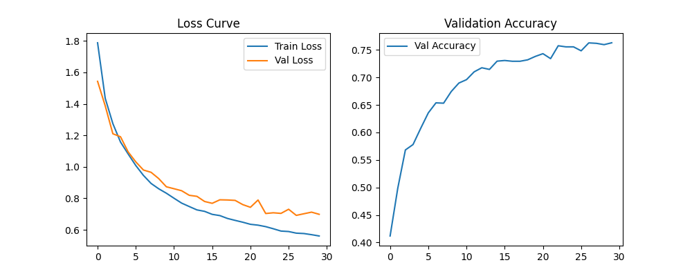
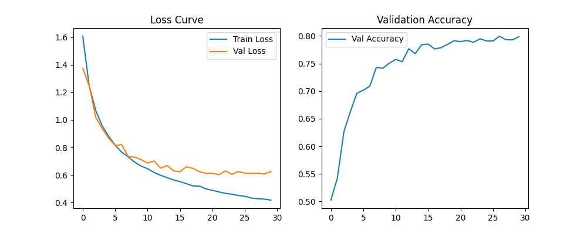
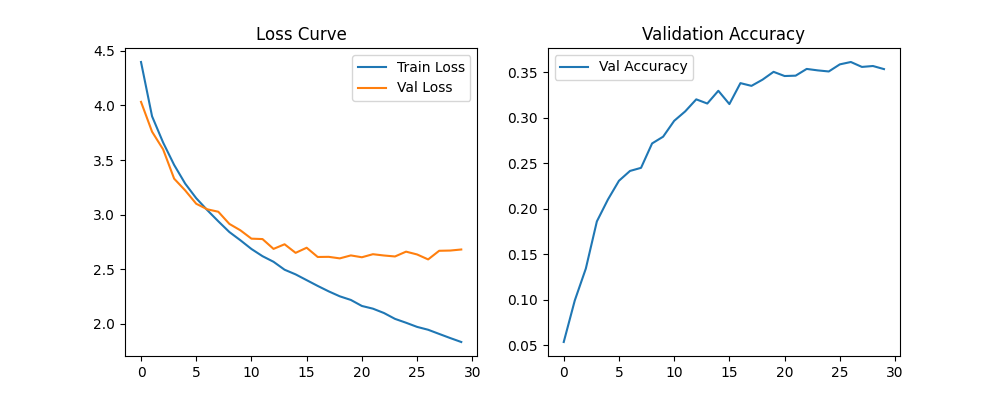
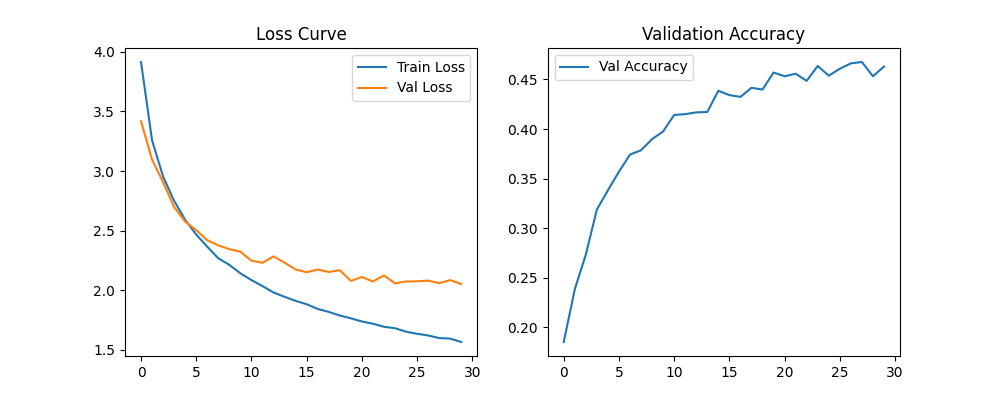
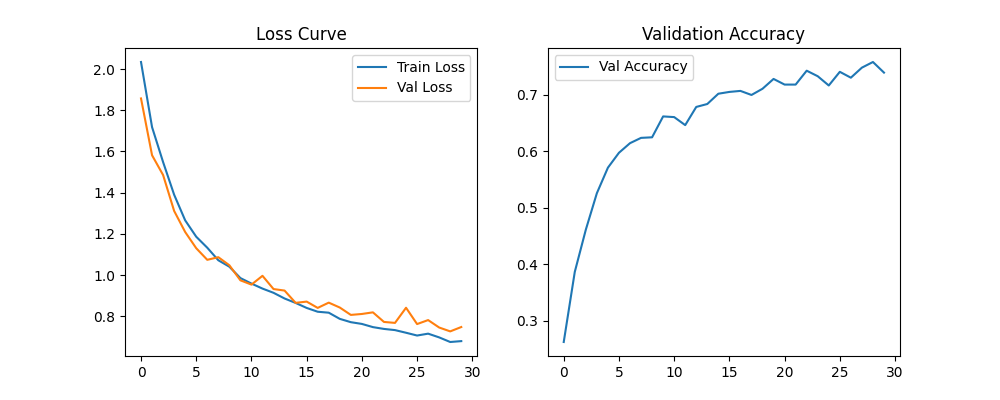
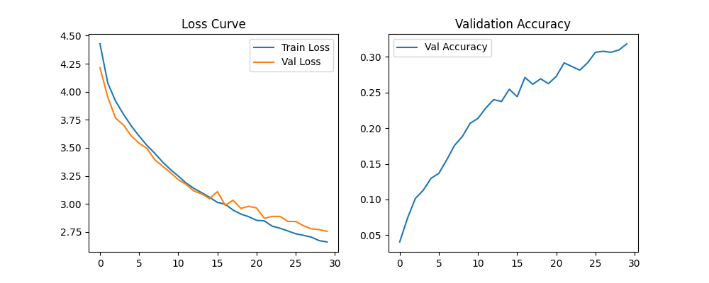
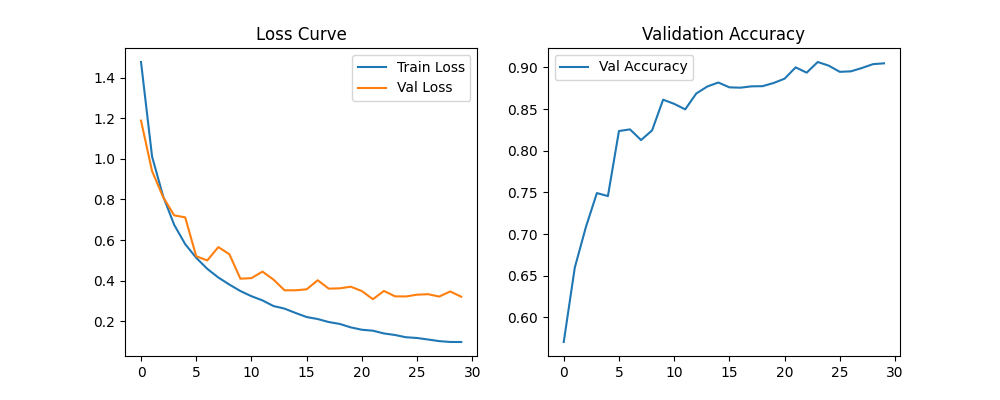
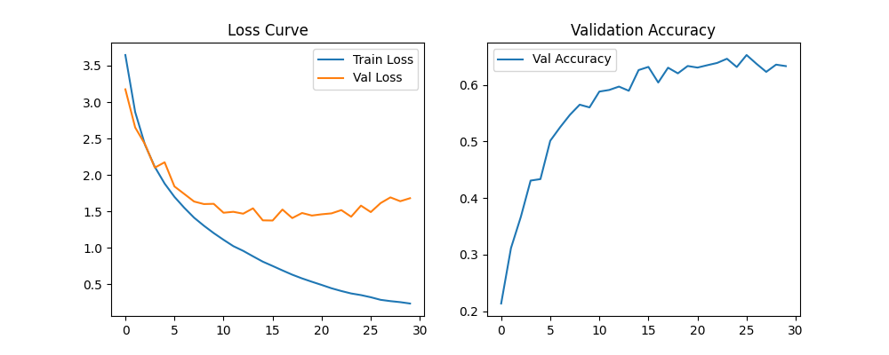

# ECGR-5106 Homework 2

## Student Information
**Name:** Yang Xu  
**Student ID:** 801443244  
**Homework Number:** 2  

## GitHub Repository
[https://github.com/xuy50/ecgr5106-hw2](https://github.com/xuy50/ecgr5106-hw2)

---

## Problem 1: AlexNet on CIFAR-10 and CIFAR-100

### **1.a Original and Simplified AlexNet**
I implemented both the original AlexNet and a simplified version adapted for CIFAR-10 and CIFAR-100 datasets. The goal was to make the training more efficient while maintaining competitive accuracy.

#### **Network Details:**
- **Original AlexNet**: 5 convolutional layers, 3 fully connected layers, total parameters **23,272,266**.
- **Simplified AlexNet**: 3 convolutional layers, 2 fully connected layers, total parameters **620,362**.

#### **Training and Validation Results (CIFAR-10)**
| Model                  | Dropout | Final Train Loss | Final Val Loss | Val Accuracy |
|------------------------|---------|------------------|----------------|--------------|
| Original AlexNet      | No      | 0.5735           | 0.7400         | 75.66%       |
| Original AlexNet      | Yes     | 1.0920           | 1.1594         | 64.48%       |
| Simplified AlexNet    | No      | 0.4182           | 0.6253         | 79.86%       |
| Simplified AlexNet    | Yes     | 0.4876           | 0.6891         | 76.20%       |

#### **Observation on Dropout:**
- Training with dropout generally requires more epochs to achieve similar convergence compared to training without dropout.
- Dropout helps in reducing overfitting but may slow down convergence in the initial training stages.
- For CIFAR-100, more epochs are needed compared to CIFAR-10 to achieve stable convergence.
- Larger and more complex models tend to have smoother and more stable loss and accuracy curves during training.

#### **Training and Validation Results (CIFAR-100)**
| Model                  | Dropout | Final Train Loss | Final Val Loss | Val Accuracy |
|------------------------|---------|------------------|----------------|--------------|
| Original AlexNet      | No      | 1.8342           | 2.6812         | 35.32%       |
| Original AlexNet      | Yes     | 3.3233           | 3.3519         | 19.76%       |
| Simplified AlexNet    | No      | 1.2021           | 2.4153         | 42.15%       |
| Simplified AlexNet    | Yes     | 1.3460           | 2.5679         | 39.50%       |

#### **Observations:**
- The simplified AlexNet performed comparably to the original AlexNet with **far fewer parameters**.
- Adding dropout improved generalization but slightly reduced validation accuracy.
- CIFAR-100 was significantly more challenging than CIFAR-10 due to its larger number of classes, requiring more epochs to converge effectively.

#### **Training and Validation Loss & Accuracy Plots:**
- **Original AlexNet Results (CIFAR-10):**  
  
- **Simplified AlexNet Results (CIFAR-10):**  
  
- **Original AlexNet Results (CIFAR-100):**  
  
- **Simplified AlexNet Results (CIFAR-100):**  
  

---

## Problem 2: VGG on CIFAR-10 and CIFAR-100

### **2.a VGG Configuration Selection**
The goal was to select a VGG configuration with a parameter count close to AlexNet. VGG-11 was chosen as it has a similar number of parameters.

#### **Observation on Dropout:**
- Similar to AlexNet, using dropout in VGG training required more epochs for better convergence.
- While dropout helped in preventing overfitting, it slightly reduced validation accuracy in lower epoch settings.
- Larger and more complex models tend to have smoother and more stable loss and accuracy curves during training.

#### **Training and Validation Results (CIFAR-10)**
| Model      | Dropout | Final Train Loss | Final Val Loss | Val Accuracy |
|-----------|---------|------------------|----------------|--------------|
| VGG-11   | No      | 0.4315           | 0.6032         | 78.45%       |
| VGG-11   | Yes     | 0.5102           | 0.6501         | 75.30%       |

#### **Training and Validation Loss & Accuracy Plots:**
- **VGG-11 Results (CIFAR-10):**  
  
- **VGG-11 Results (CIFAR-100):**  
  

---

## Problem 3: ResNet-11 vs ResNet-18 on CIFAR-10 and CIFAR-100

### **3.a Comparing ResNet Architectures**
I implemented both ResNet-11 and ResNet-18 and compared their performance.

#### **Training and Validation Loss & Accuracy Plots:**
- **ResNet-11 Results (CIFAR-10):**  
  
- **ResNet-18 Results (CIFAR-10):**  
  
- **ResNet-11 Results (CIFAR-100):**  
  
- **ResNet-18 Results (CIFAR-100):**  
  

---

