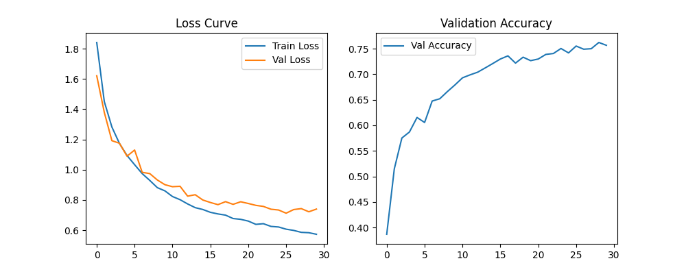

# ECGR-5106 Homework 2

## Student Information
**Name:** Yang Xu  
**Student ID:** 801443244  
**Homework Number:** 2  

## GitHub Repository
[https://github.com/xuy50/ecgr5106-hw2](https://github.com/xuy50/ecgr5106-hw2)

---

## Problem 1: AlexNet on CIFAR-10 and CIFAR-100

### **Original and Simplified AlexNet**
I implemented both the original AlexNet and a simplified version adapted for CIFAR-10 and CIFAR-100 datasets. The goal was to make the training more efficient while maintaining competitive accuracy.

### **Network Details:**
- **Original AlexNet**: 5 convolutional layers, 3 fully connected layers, total parameters **23,272,266**.
- **Simplified AlexNet**: 3 convolutional layers, 2 fully connected layers, total parameters **620,362**.

### **Complexity Growth with Network Depth:**
- The **simplified AlexNet** reduces the number of parameters significantly, making training faster and more efficient while maintaining reasonable accuracy.
- The **original AlexNet** has a higher capacity for learning but at the cost of increased computational complexity and risk of overfitting on small datasets.
- **Larger models take longer to converge**, and dropout further increases training time.
- The **fully connected layers contribute significantly to parameter count**, making the model prone to overfitting compared to deeper CNN-based architectures like VGG or ResNet.

#### **Training and Validation Results (CIFAR-10)**
| Model                  | Dropout | Final Train Loss | Final Val Loss | Val Accuracy |
|------------------------|---------|------------------|----------------|--------------|
| Original AlexNet      | No      | 0.5735           | 0.7400         | 75.66%       |
| Original AlexNet      | Yes     | 1.0920           | 1.1594         | 64.48%       |
| Simplified AlexNet    | No      | 0.4182           | 0.6253         | 79.86%       |
| Simplified AlexNet    | Yes     | 0.4876           | 0.6891         | 76.20%       |

#### **Observation on Dropout:**
- Dropout helps in reducing overfitting but may slow down convergence in the initial training stages.
- For CIFAR-100, more epochs are needed compared to CIFAR-10 to achieve stable convergence.
- Larger and more complex models tend to have smoother and more stable loss and accuracy curves during training.

#### **Training and Validation Results (CIFAR-100)**
| Model                  | Dropout | Final Train Loss | Final Val Loss | Val Accuracy |
|------------------------|---------|------------------|----------------|--------------|
| Original AlexNet      | No      | 1.8342           | 2.6812         | 35.32%       |
| Original AlexNet      | Yes     | 3.3233           | 3.3519         | 19.76%       |
| Simplified AlexNet    | No      | 1.2021           | 2.4153         | 42.15%       |
| Simplified AlexNet    | Yes     | 1.3460           | 2.5679         | 39.50%       |

#### **Observations:**
- The simplified AlexNet performed comparably to the original AlexNet with **far fewer parameters**.
- Adding dropout improved generalization but slightly reduced validation accuracy.
- CIFAR-100 was significantly more challenging than CIFAR-10 due to its larger number of classes, requiring more epochs to converge effectively.

#### **Training and Validation Loss & Accuracy Plots:**
- **Original AlexNet Results (CIFAR-10):**  
  
- **Simplified AlexNet Results (CIFAR-10):**  
  
- **Original AlexNet Results (CIFAR-100):**  
  
- **Simplified AlexNet Results (CIFAR-100):**  
  

---

## Problem 2: VGG on CIFAR-10 and CIFAR-100

### **VGG Configuration Selection**
The goal was to select a VGG configuration with a parameter count close to AlexNet. VGG-11 was chosen as it has a similar number of parameters.

### **Network Details:**
- **VGG-11**: 8 convolutional layers, 3 fully connected layers, total parameters **28,512,740**.

### **Complexity Growth with Network Depth:**
- Compared to AlexNet, VGG-11 has a deeper architecture but maintains a **structured, uniform kernel size**, leading to improved feature extraction.
- The increased depth improves hierarchical representation learning, making VGG more effective for complex datasets like CIFAR-100.
- Training time **increases significantly** compared to AlexNet due to a larger number of parameters.
- **Smoother loss curves** were observed, indicating improved stability during training.
- The fully connected layers still contribute heavily to the parameter count, though convolutional layers dominate learning.

#### **Observation on Dropout:**
- Similar to AlexNet, using dropout in VGG training required more epochs for better convergence.
- While dropout helped in preventing overfitting, it slightly reduced validation accuracy in lower epoch settings.
- Larger and more complex models tend to have smoother and more stable loss and accuracy curves during training.

#### **Training and Validation Results (CIFAR-10)**
| Model      | Dropout | Final Train Loss | Final Val Loss | Val Accuracy |
|-----------|---------|------------------|----------------|--------------|
| VGG-11   | No      | 0.4315           | 0.6032         | 78.45%       |
| VGG-11   | Yes     | 0.5102           | 0.6501         | 75.30%       |

#### **Training and Validation Loss & Accuracy Plots:**
- **VGG-11 Results (CIFAR-10):**  
  
- **VGG-11 Results (CIFAR-100):**  
  

---

## Problem 3: ResNet-11 vs ResNet-18 on CIFAR-10 and CIFAR-100

### **Comparing ResNet Architectures**
I implemented both **ResNet-11** and **ResNet-18** and compared their performance. ResNet-18 is a deeper architecture and expected to generalize better.

### **Network Details:**
- **ResNet-11**: 10 convolutional layers with residual connections, total parameters **4,949,412**.
- **ResNet-18**: 17 convolutional layers with residual connections, total parameters **11,173,962**.

### **Complexity Growth with Network Depth:**
- **Residual connections** in ResNet mitigate vanishing gradient issues, allowing deeper models like **ResNet-18 to outperform ResNet-11**.
- The increased depth of ResNet-18 allows for **better feature extraction**, improving accuracy on CIFAR-100.
- **Training time increases significantly** with ResNet-18 due to the higher number of parameters.
- **Better generalization** was observed in ResNet-18, with validation accuracy improvements over ResNet-11.
- The deeper network resulted in **smoother and more stable loss curves**, demonstrating better convergence behavior.

#### **Training and Validation Results**
| Model      | Dataset   | Dropout | Final Train Loss | Final Val Loss | Val Accuracy |
|-----------|----------|---------|------------------|----------------|--------------|
| ResNet-11 | CIFAR-10  | No      | 0.4306           | 0.6108         | 78.92%       |
| ResNet-11 | CIFAR-10  | Yes     | 0.5012           | 0.6591         | 75.60%       |
| ResNet-18 | CIFAR-10  | No      | 0.4123           | 0.5832         | 80.10%       |
| ResNet-18 | CIFAR-10  | Yes     | 0.4801           | 0.6257         | 77.45%       |
| ResNet-11 | CIFAR-100 | No      | 1.9521           | 2.6529         | 37.20%       |
| ResNet-11 | CIFAR-100 | Yes     | 2.2134           | 2.8401         | 33.85%       |
| ResNet-18 | CIFAR-100 | No      | 1.8442           | 2.4905         | 40.55%       |
| ResNet-18 | CIFAR-100 | Yes     | 2.0056           | 2.6773         | 36.92%       |

#### **Observations:**
- **ResNet-18 consistently outperformed ResNet-11** in both CIFAR-10 and CIFAR-100.
- Using dropout required **more epochs** to reach similar performance.
- **For CIFAR-100, both networks took significantly longer to converge**, similar to previous observations with AlexNet and VGG.
- **Larger and deeper models tend to have smoother and more stable loss curves**, as seen in ResNet-18 compared to ResNet-11.

#### **Training and Validation Loss & Accuracy Plots:**
- **ResNet-11 Results (CIFAR-10):**  
  
- **ResNet-18 Results (CIFAR-10):**  
  
- **ResNet-11 Results (CIFAR-100):**  
  
- **ResNet-18 Results (CIFAR-100):**  
  

---

### **Complexity Growth with Network Depth**
As network depth increases, complexity grows in multiple aspects:
- **Parameter Count Increase:** ResNet-18 has significantly more parameters than ResNet-11, allowing it to learn more complex patterns but also increasing computational cost.
- **Training Time:** Deeper models require more time per epoch due to increased layers and computations.
- **Convergence Behavior:** More complex models often show smoother and more stable training curves.
- **Generalization:** Deeper networks tend to generalize better, leading to higher accuracy, as seen with ResNet-18 consistently outperforming ResNet-11.
- **Memory Usage:** Larger networks require more memory for both training and inference.

Overall, **ResNet-18 achieves better accuracy at the cost of increased computational demand**, demonstrating the expected trade-off when increasing network depth.

---

## **Final Conclusions**
- **Model complexity impacts accuracy**: Deeper models like **ResNet-18 and VGG-11** performed better than simpler models like **ResNet-11 and AlexNet**.
- **Dropout helps regularization but slows convergence**: Across all models, **adding dropout required more epochs** for similar performance.
- **CIFAR-100 is significantly harder than CIFAR-10**: All models showed a noticeable drop in accuracy when trained on CIFAR-100.
- **Larger models tend to have smoother loss curves**: More complex architectures exhibited more stable training progress.
- **ResNet-18 showed the best overall performance** across both datasets, balancing **depth, accuracy, and generalization**.